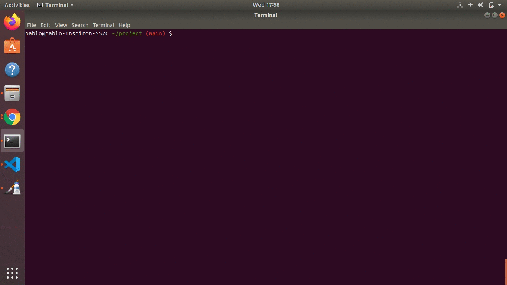
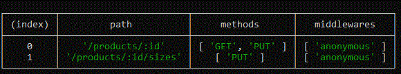

# express-route-list-cli

```sh
npm i express-route-list-cli
```
## Overview

<p> Provide an overview of all of the routes that are defined by your application from the command line.<p>

<p>
  <a href="https://laravel.com">Laravel</a> (<a href="https://laravel.com/docs/routing#the-route-list">route:list</a>) inspired cli command.
</p>

```sh
npx route-list <relative app file path>
```

<p align='center'>
    
</p>

## Rooting files

<p> In order to get routing files type "-r" or "-d" (for detailed info)<p>

```sh
npx route-list <relative app file path> -r
```

<p align='center'>
    
</p>

## Usage

```
npx route-list --help
```
```
route-list <relative app file path>

Options:
      --version               Show version number                      [boolean]
  -p, --path                  filter endpoints by path                  [string]
  -m, --method                filter endpoints by method                [string]
  -w, --middleware            filter endpoints by middleware            [string]
  -r, --routingFiles          show routing files
  -d, --detailedRoutingFiles  show detailed routing files
      --help                  Show help                                [boolean]
```

## Tip

Add script to package.json

```
  "scripts": {
    "route:list": "npx route-list <relative app file path>"
  },
```

<p>"route:list" script has app file path implicit.</p>
<br>
<p>In order to run such scrip with parameters add "--" to "npm run route:list" as follows</p>

```
npm run route:list -- -p products -m PUT
```

