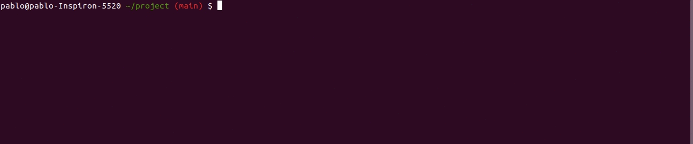

# express-route-list-cli
## Install
```sh
npm i express-route-list-cli
```
## Overview
<p> Provide an overview of all of the routes that are defined by your application from the command line.</p>
<p>
  <a href="https://laravel.com">Laravel</a> (<a href="https://laravel.com/docs/routing#the-route-list">route:list</a>) inspired cli command.
</p>

## Usage
```
npx route-list --help

route-list <relative app file path>

Options:
      --version               Show version number                      [boolean]
  -p, --path                  filter endpoints by path                  [string]
  -m, --method                filter endpoints by method                [string]
  -w, --middleware            filter endpoints by middleware            [string]
  -f, --routingFiles          show routing files
  -d, --detailedRoutingFiles  show detailed routing files
      --help                  Show help                                [boolean]
```
<p align='center'>
    
</p>
