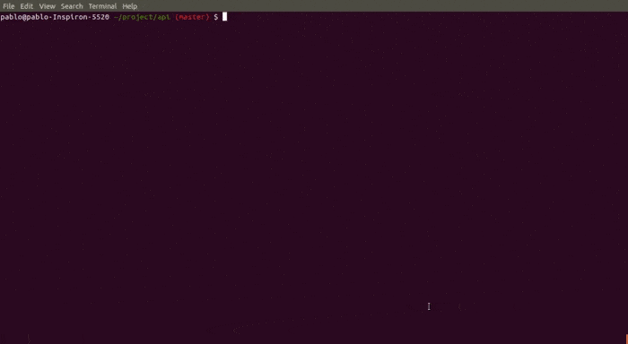

# express-route-list-cli

```sh
npm i express-route-list-cli
```
## Overview

<p> Provide an overview of all of the routes that are defined by your application from the command line.<p>

<p>
  <a href="https://laravel.com/docs/routing#the-route-list">Laravel</a> (route:list) inspired cli command.
</p>

```sh
npx route-list <absolute app file path>
```

<p align='center'>
    
</p>

## Usage

```
~$ npx route-list --help
route-list <absolute_app_file_path>

Options:
      --version     Show version number                                [boolean]
  -p, --path        filter endpoints by path                            [string]
  -m, --method      filter endpoints by method                          [string]
  -w, --middleware  filter endpoints by middleware                      [string]
      --help        Show help                                          [boolean]
```

## Shortcut

Add script to package.json

```
  "scripts": {
    "route:list": "npx route-list <absolute_app_file_path>"
  },
```

The new script has the implicit application path

```
npm run route:list -- -p products -m PUT
```

